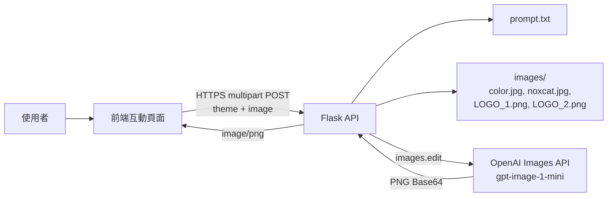

# NOXCAT Cyber Photo Generator

## 問題與目標

NOXCAT 將使用者照片、品牌色彩規範與角色原型整合為一致的賽博互動影像。它面向活動參與者與品牌行銷團隊，將原本需由設計師反覆製作的情境合照，縮短為一次上傳與主題選擇。

目標是在維持人物辨識度、NOXCAT 角色特徵及品牌色彩規範的前提下，生成可直接分享的系列主視覺。

## 核心功能

- 接收使用者照片與指定互動主題，生成 NOXCAT 賽博情境照。
- 固定使用色彩規範、NOXCAT 原型及兩張品牌標誌作為模型參考圖片。
- 以 `prompt.txt` 集中管理角色、材質、色彩與攝影風格規範。
- 驗證上傳格式與大小，並處理客戶端中斷上傳的情況。

## 系統架構



前端將主題代號與使用者照片傳至 `POST /api/generate`。Flask 後端讀取提示詞與四張本機參考圖，將它們加上使用者照片後傳給 OpenAI Images API，最後把生成的 PNG 回傳前端。目前不使用資料庫，也不持久化使用者照片或生成結果。

## 使用技術

| 類型 | 技術／服務 | 用途 |
| --- | --- | --- |
| AI 模型 | OpenAI `gpt-image-1-mini` | 依提示詞與多張參考圖進行影像編輯與生成 |
| 前端 | 外部網站前端 | 上傳照片、選擇主題與顯示生成結果 |
| 後端 | Python、Flask、Hypercorn | REST API、multipart 解析、HTTPS 服務 |
| Sponsor 技術 | OpenAI API | 圖像生成能力 |

## 安裝與執行

需求：Python 3.10 以上，以及可存取 OpenAI API 的金鑰。

```powershell
git clone https://github.com/ShadowZawa/noxcat.git
Set-Location noxcat\server

python -m venv .venv
.\.venv\Scripts\Activate.ps1
python -m pip install -r requirements.txt

Set-Content -Path .env -Value "API_KEY=your_openai_api_key"
python main.py
```

服務預設監聽 `https://0.0.0.0:3022`。若使用 `start.bat`，請先將其中的 `PYTHON_EXE` 改為本機 Python 或虛擬環境的 `python.exe` 路徑。

API 請求範例：

```powershell
curl.exe -k -X POST "https://localhost:3022/api/generate" `
	-F "theme=cyber-fist-bump" `
	-F "image=@.\example.jpg;type=image/jpeg" `
	--output noxcat-generated.png
```

可用主題：`cyber-fist-bump`、`holographic-map`、`rooftop-watch`、`tracking-mission`、`goggles-repair`、`future-motorcycle`、`rainy-night-umbrella`、`street-rest-stop`、`access-hack`、`victory-selfie`。

## API 規範

### `POST /api/generate`

依使用者照片、選定主題與伺服器端品牌參考圖生成 PNG。請求內容類型必須為 `multipart/form-data`；瀏覽器使用 `FormData` 時不應手動設定 `Content-Type`，讓瀏覽器自動附加 boundary。

| 欄位 | 類型 | 必填 | 說明 |
| --- | --- | --- | --- |
| `image` | 檔案 | 是 | 使用者照片。支援 `image/jpeg`、`image/png`、`image/webp`。 |
| `theme` | 字串 | 是 | 十個可用主題代號之一。 |

伺服器依序將 `images/color.jpg`、`images/noxcat.jpg`、`images/LOGO_1.png`、`images/LOGO_2.png` 與上傳照片傳至模型。單一 HTTP 請求上限為 10 MB。

成功回應：

```http
HTTP/1.1 200 OK
Content-Type: image/png
Content-Disposition: inline; filename="noxcat-generated.png"
```

回應內容為 PNG binary，前端應以 `response.blob()` 讀取，而非 JSON。

### `OPTIONS /api/generate`

用於跨網域的 CORS 預檢。成功時回傳 `204 No Content`，並包含：

```http
Access-Control-Allow-Origin: *
Access-Control-Allow-Methods: POST, OPTIONS
Access-Control-Allow-Headers: Content-Type
```

### 錯誤回應

除 `499` 外，錯誤通常回傳 JSON：

```json
{
	"error": "錯誤說明"
}
```

| 狀態碼 | `error` 值或情況 | 原因與處理方式 |
| --- | --- | --- |
| `400` | `prompt.txt is empty.` | `server/prompt.txt` 沒有提示詞內容。填入生成規範後重啟服務。 |
| `400` | `Unable to read uploaded form data.` | multipart 格式錯誤，常見原因是前端手動設定 `Content-Type` 而遺失 boundary。使用 `FormData` 直接作為 `fetch` body。 |
| `400` | `Unable to read uploaded image.` | 無法解析圖片上傳內容。確認欄位名稱為 `image`。 |
| `400` | `A valid quiz theme is required.` | 缺少 `theme`，或 theme 代號不在可用清單中。 |
| `400` | `Missing image upload.` | 請求未附帶 `image` 檔案，或檔名為空。 |
| `400` | `Empty image upload.` | 上傳檔案大小為 0 bytes。重新選擇有效圖片。 |
| `413` | `Image must be 10 MB or smaller.` | 請求大小超過 10 MB。縮小或壓縮圖片後重試。 |
| `415` | `Unsupported image type.` | 上傳 MIME type 非 JPEG、PNG 或 WebP。轉換為支援格式。 |
| `499` | 空回應 | 客戶端在伺服器完成讀取 multipart body 前取消請求或中斷連線。確認網路穩定，並在前端不要過早取消 `fetch`。 |
| `500` | `API_KEY is not configured.` | 伺服器 `.env` 未設定 `API_KEY`，或服務未從含有 `.env` 的目錄啟動。 |
| `500` | `prompt.txt was not found.` | 服務的目前工作目錄找不到 `prompt.txt`。從 `server/` 啟動 `main.py`。 |
| `500` | `Missing required reference image: images/<file>` | `server/images/` 缺少必要的 `color.jpg`、`noxcat.jpg`、`LOGO_1.png` 或 `LOGO_2.png`。補齊檔案後重試。 |
| `502` | `Image generation failed.` | OpenAI Images API 請求失敗，例如 API key 無效、額度不足、模型暫時無法使用或網路問題。查看 server console 的 `OpenAI image generation failed` 紀錄取得詳細原因。 |

伺服器會在 console 記錄請求大小、選定主題與模型錯誤細節；不要將 API key 或使用者原始照片寫入日誌。

## 作品展示

- 作品展示網址：https://shadowzawa.github.io/noxcat/
- 評選影片：待補

## 限制與未來工作

- 生成品質與人物、角色的一致性仍受模型輸出影響，結果需要人工挑選。
- API 目前只支援 JPEG、PNG、WebP，且單一請求上限為 10 MB。
- API key 由伺服器環境變數保管；正式環境應加入身分驗證、速率限制與用量監測。
- 後續可加入任務佇列、生成歷史、結果儲存與前端進度回報。

## 第三方服務、資料與素材

| 項目 | 來源 | 授權或使用方式 |
| --- | --- | --- |
| OpenAI Images API | https://platform.openai.com/docs/guides/image-generation | 依 OpenAI 服務條款與帳戶用量計費使用 |
| Flask | https://flask.palletsprojects.com/ | BSD-3-Clause |
| Hypercorn | https://hypercorn.readthedocs.io/ | MIT |
| NOXCAT 原型、品牌色彩與標誌 | 專案團隊提供，位於 `server/images/` | 僅供本專案展示與生成流程使用 |
| 使用者照片 | 使用者上傳 | 僅在請求期間轉送模型，不由本服務持久化保存 |

請勿將 `.env`、API key、Token、私人照片或其他個人資料提交至儲存庫。

## 團隊成員

| 姓名 | 分工 |
| --- | --- |
| 待補 | 待補 |

## License

本專案採用 [Apache License 2.0](LICENSE)。
