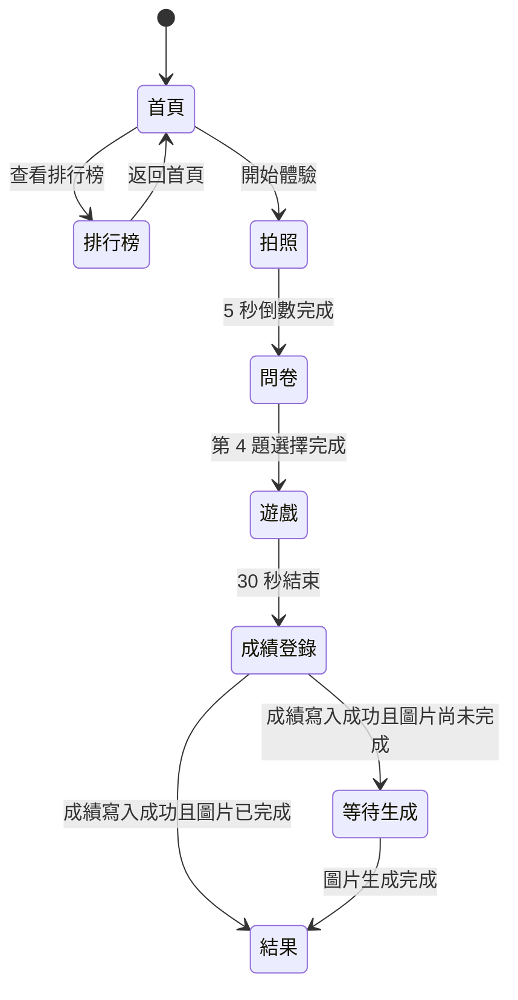
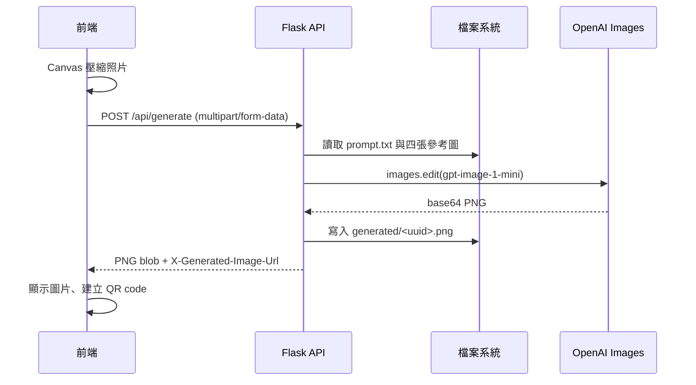

# NOXCAT 技術文件

## 1. 系統範圍

NOXCAT 是由 GitHub Pages 靜態前端與單一 HTTPS Python 服務組成的互動影像體驗。使用者以手機前置鏡頭拍照、完成四題測驗、在圖片生成期間以手勢玩捕捉遊戲，接著輸入暱稱登錄分數並查看生成結果與 QR code。

系統沒有資料庫。生成的圖檔存放在本機目錄，排行榜則存放在 JSON 檔案。這種部署適合單一主機、短期活動與原型驗證。

## 2. 專案結構

```text
noxcat/
|- docs/                       GitHub Pages 靜態網站根目錄
|  |- index.html               所有使用者介面 stage
|  |- noxcat.css               視覺與手機版單頁排版
|  |- noxcat.js                鏡頭、測驗、遊戲、API 與 UI 狀態
|  |- logo.png                 網站與載入標誌
|  |- cat.png                  捕捉遊戲中的目標圖片
|  |- CatPaw.png               偵測到手掌時的 Canvas 標記
|  `- start-art.png            首頁背景圖
|- server/                     HTTPS API，必須由此目錄啟動
|  |- main.py                  Flask 路由、OpenAI 呼叫、檔案儲存
|  |- prompt.txt               圖像生成的共用提示詞規範
|  |- images/                  固定品牌參考圖
|  |- generated/               生成後可供 QR code 下載的 PNG
|  |- rank.json                前 10 名排行榜資料
|  |- .env                     實際環境變數，不可提交
|  |- .env.example             環境變數範本
|  |- requirements.txt         Python 套件版本
|  `- start.bat                Windows 啟動輔助程式
|- imgs/                       README 展示素材
|- README.md                   專案說明
`- tech.md                     本文件
```

所有 `server/main.py` 的相對路徑皆以目前工作目錄為準。因此必須在 `server/` 下執行 `python main.py` 或 `start.bat`。

## 3. 元件與責任

| 層級 | 元件 | 責任 |
| --- | --- | --- |
| 靜態託管 | GitHub Pages | 發布 `docs/`，提供網站 UI。 |
| 前端 | `index.html` | 定義 stage、控制項與可存取性標籤。 |
| 前端 | `noxcat.js` | 管理拍照、問卷、遊戲、生成、QR code 和排行榜請求。 |
| 前端 | MediaPipe Hands | 偵測單隻手掌 landmark。 |
| 前端 | QRCode.js | 產生公開下載網址的 QR code。 |
| API | Flask | 處理圖片生成、圖片下載與排行榜。 |
| HTTPS 伺服器 | Hypercorn | 將 WSGI Flask 應用以 TLS 暴露在 3022 連接埠。 |
| AI | OpenAI Images API | 使用 `gpt-image-1-mini` 執行多圖參考的 `images.edit`。 |
| 儲存 | 本機檔案系統 | 保存生成 PNG 與 `rank.json`。 |

## 4. 使用者流程與前端狀態



`showStage()` 是主要畫面切換入口。它利用 HTML 的 `hidden` 屬性切換 stage，並設定 `.app` 的 `data-stage`。CSS 依該屬性隱藏拍照 `hero`，避免拍照框與排行榜、暱稱頁、問卷、遊戲、等待或結果頁重疊。

### 4.1 拍照

1. 首頁 `introStartButton` 呼叫 `startExperience()`。
2. `startCamera()` 使用 `navigator.mediaDevices.getUserMedia()` 請求前置鏡頭，約束為 `facingMode: { ideal: 'user' }`。
3. HTTPS 或瀏覽器不支援鏡頭時，程式會呼叫 `useDefaultPhoto()` 產生本機示意 Canvas，而不會中斷體驗。
4. 使用者點擊拍照後，`startCountdown()` 倒數 5 秒。
5. `capturePhoto()` 把 video 畫面寫入 `snapshot` Canvas。

鏡頭框為 $1:1$。Canvas 保留原始 video 尺寸；畫面框比例不會改變實際上傳影像的解析度。

### 4.2 問卷與主題

共有四題。前三題資料用於結果標籤，第四題的 `data-theme` 決定生成主題。所有選項會寫入 `answers`：

```javascript
{
	impulse: { answer: '...', theme: '...' },
	rhythm: { answer: '...', theme: '...' },
	instinct: { answer: '...', theme: '...' },
	memory: { answer: '...', theme: 'future-motorcycle' }
}
```

最後一題選取後，`generateFinalPhoto()` 同時開始 OpenAI 生成請求與 `playCatchGame()`。

### 4.3 手勢遊戲

遊戲先顯示 5 秒準備倒數，再開始 30 秒計分。

- MediaPipe 僅追蹤一隻手：`maxNumHands: 1`。
- 以 landmark `9` 作為掌心近似位置。
- 鏡頭影像會水平翻轉，故 X 座標使用 $1 - x$ 對齊畫面。
- 手掌標記以 Canvas 的 `drawImage()` 繪製 `CatPaw.png`，大小為 88 Canvas pixels。
- 目標由 `moveGameTarget()` 隨機放在 $x \in [0.16, 0.84]$、$y \in [0.18, 0.78]$。
- 命中距離為 $d = \sqrt{(x_p-x_t)^2 + (y_p-y_t)^2}$。當 $d < 0.13$ 且目標未處於等待移動狀態時，分數加一。
- `gameTargetHitPending` 防止同一目標在 220 ms 動畫期間連續加分。

遊戲目標 `cat.png` 和手掌圖 `CatPaw.png` 皆位於 `docs/`，因此 GitHub Pages 部署時會使用相對網址載入。

### 4.4 成績登錄與排行榜

遊戲結束時 `playCatchGame()` 呼叫 `showScoreEntry()`，並等待使用者成功提交暱稱。`submitScore()` 會以 `URLSearchParams` 送出 `nickname` 與 `score`。

使用 `application/x-www-form-urlencoded` 是刻意的相容性設計：它是 CORS simple request，不需預先送出 JSON `Content-Type` 造成的 `OPTIONS` 預檢。此做法可避開目前 Hypercorn WSGI 包裝處理空 `OPTIONS` 回應時產生的 `UnexpectedMessageError`。

首頁的「查看排行榜」呼叫 `showLeaderboard()`，以 `GET /api/leaderboard` 載入資料；`renderLeaderboard()` 使用 DOM API 設定 `textContent`，不使用 `innerHTML` 插入暱稱，可降低跨站腳本風險。

## 5. 圖片生成流程



`canvasToUploadBlob()` 依序嘗試最大邊長 1280、960、720，並優先 WebP、其次 JPEG；目標大小為 1.5 MB 以下。伺服器 HTTP request 上限則為 10 MB。

目前的固定參考圖片送入順序：

1. `images/color.jpg`
2. `images/noxcat.jpg`
3. `images/LOGO_1.png`
4. `images/LOGO_2.png`
5. 使用者上傳照片

主題代號由 `THEME_PROMPTS` 白名單驗證，不能由客戶端任意提供模型提示詞取代伺服器規範。

## 6. API 合約

| Method | Path | 請求 | 成功回應 |
| --- | --- | --- | --- |
| `POST` | `/api/generate` | `multipart/form-data`，包含 `image`、`theme` | `200 image/png`，含 `X-Generated-Image-Url`。 |
| `GET` | `/generated/<image-id>.png` | 無 | `200 image/png`，附件下載。 |
| `GET` | `/api/leaderboard` | 無 | `200 { "entries": [...] }`。 |
| `POST` | `/api/leaderboard` | form 或 JSON 的 `nickname`、`score` | `201 { "entries": [...] }`。 |

所有回應均有 `Access-Control-Allow-Origin: *`。生成圖片 header 額外使用 `Access-Control-Expose-Headers: X-Generated-Image-Url`，讓跨網域前端可讀取下載 URL。

## 7. 排行榜資料與併發

`server/rank.json` 的格式為 JSON array：

```json
[
	{
		"nickname": "大龍",
		"score": 34,
		"recordedAt": "2026-09-05T09:34:10.914034+00:00"
	}
]
```

寫入流程：

1. 使用 `threading.Lock` 取得單一 Python process 的寫入權。
2. 讀取既有 JSON；檔案遺失、壞掉或非 array 時以空清單處理並記錄 console 錯誤。
3. 驗證暱稱與分數，加入 `recordedAt` UTC ISO 8601 時間。
4. 依 `score` 由高至低排序，切片保留前 10 名。
5. 寫入 `rank.tmp`，再使用 `replace()` 原子取代 `rank.json`。

此 lock 只涵蓋同一個 Python process。不要用多個 Hypercorn worker 或多台 API server 共用這個 JSON 檔，否則應改用 SQLite、PostgreSQL、Redis 或雲端資料庫，並於後端根據有效遊戲事件驗證分數。現行 API 接受前端送來的 score，無法防止使用者自行修改請求。

## 8. 設定與部署

### 8.1 環境變數

建立 `server/.env`：

```dotenv
API_KEY=YOUR_OPENAI_API_KEY
SERVER_IP=https://your-public-host:3022
```

- `API_KEY`：OpenAI 伺服器端金鑰，絕不可放入 `docs/` 或 Git。
- `SERVER_IP`：QR code 使用的公開 API base URL。可填 `https://host:port`，或 `host:port` 讓程式補上 `https://`。
- `PUBLIC_BASE_URL`：可作為 `SERVER_IP` 的替代環境變數。

### 8.2 HTTPS

瀏覽器要求安全內容才能存取鏡頭，GitHub Pages 也以 HTTPS 運作，因此 API 必須具備有效的公開 TLS 憑證。Hypercorn 設定讀取：

```text
server/cert/cert_chain.pem
server/cert/key.pem
```

目前私鑰密碼設定在 `main.py`。正式部署應改由受保護的環境變數、秘密管理服務或反向代理 TLS 終結處理，並避免把私鑰或密碼提交到版控。

### 8.3 Windows 啟動

```powershell
Set-Location server
python -m venv .venv
.\.venv\Scripts\Activate.ps1
python -m pip install -r requirements.txt
python main.py
```

`start.bat` 內的 `PYTHON_EXE` 必須指向本機可用的 Python executable。服務監聽 `0.0.0.0:3022`，防火牆、路由器或反向代理必須允許此連接埠，且 `SERVER_IP` 必須能由手機網路存取。

## 9. 手機與可用性規範

網站以單一 stage 呈現流程，並使用 `[hidden] { display: none !important; }` 保證非目前 stage 不佔版面。行動版在 `max-width: 520px` 下限制相機、遊戲、結果圖和 QR code 區域尺寸，排行榜列高為 32px。以 375 x 667 viewport 搭配完整 10 筆排行榜、四個結果標籤和 QR code 驗證，各 stage 無水平或垂直捲動。

後續更動任何 stage 的 HTML 或 CSS 後，應重新測試：首頁、拍照、四題問卷、遊戲、暱稱登錄、等待、結果與完整排行榜。

## 10. 維運與安全建議

- 為 `/api/generate` 及 `/api/leaderboard` 加上 IP 或 session 速率限制，避免 API 濫用與排行榜洗分。
- 對生成 API 加入排隊、逾時、可觀測性與用量告警。
- 為 `generated/` 建立定期清理程序，或改用設定到期時間的物件儲存與簽名 URL。
- 對 QR 下載路由加入難猜測 UUID 之外的有效期與存取控制。
- 避免在 log 輸出 `API_KEY`、照片 bytes、完整表單內容或其他個人資料。
- 若需長期保存排行榜，遷移到資料庫並對暱稱做更嚴謹的 Unicode、重複名稱與內容審核規則。
- 在公開活動前設定 CSP、HSTS、反向代理 request limit，並監控 OpenAI API 配額。

## 11. 驗證指引

### 11.1 靜態檢查

```powershell
Set-Location g:\noxcat
node --check docs\noxcat.js
g:\skywing\.venv\Scripts\python.exe -m py_compile server\main.py
git diff --check
```

### 11.2 排行榜 API 煙霧測試

先啟動 API 後執行：

```powershell
curl.exe -k https://localhost:3022/api/leaderboard
curl.exe -k -X POST https://localhost:3022/api/leaderboard `
	-d "nickname=TEST&score=10"
```

確認回傳的 `entries` 依分數遞減、最多十筆，並確認 `server/rank.json` 同步更新。

### 11.3 端對端檢查

1. 以 HTTPS 開啟 GitHub Pages 或同等 HTTPS 靜態站點。
2. 允許前置鏡頭權限，拍攝一張照片。
3. 選完四題，確認遊戲可見 `cat.png` 目標與 `CatPaw.png` 手掌標記。
4. 遊戲結束後送出 1 至 20 字元暱稱。
5. 確認 `rank.json` 更新、首頁排行榜顯示名次。
6. 確認生成結果可顯示，並以另一支裝置掃描 QR code 下載 PNG。